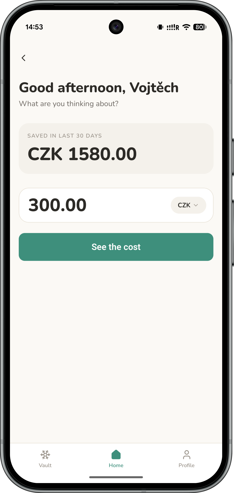
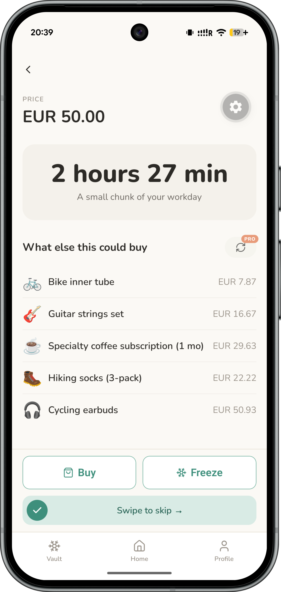
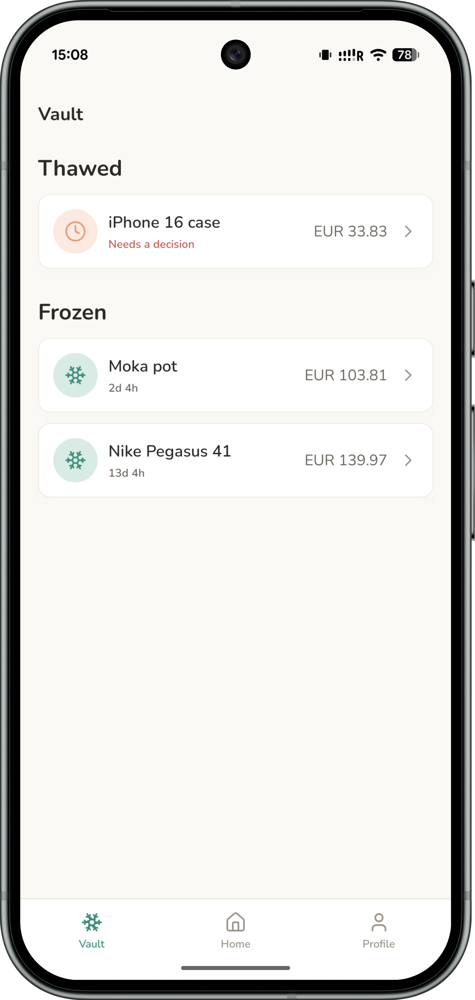
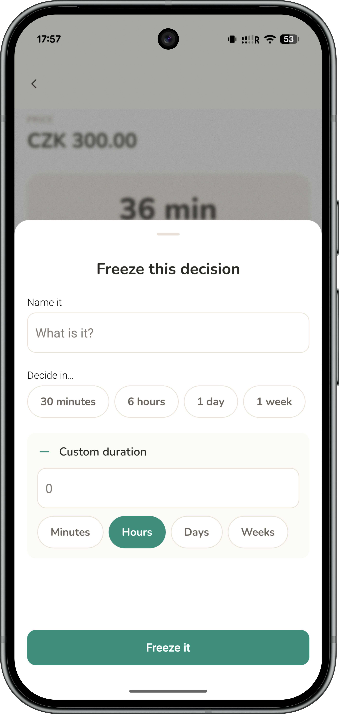
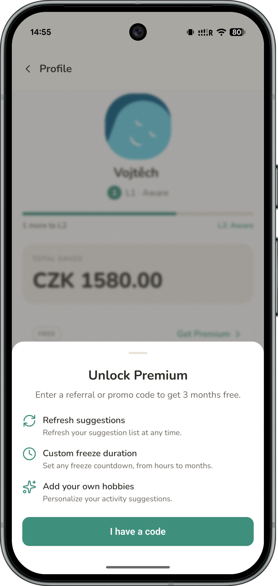

# BadBuy

> Master your money by turning impulsive buys into conscious choices.

BadBuy is a React Native mobile app that reframes prices as **work hours** — so before you buy, you see what that purchase actually costs you in time. It's calm, non-judgmental, and built around one idea: a mindful pause can change a decision.

---

## Table of Contents

- [🖼️ Screenshots](#️-screenshots)
- [🚀 Features](#-features)
- [🛠️ Tech Stack](#️-tech-stack)
- [🎯 How It Works](#-how-it-works)
- [📦 Installation](#-installation)
- [🔧 Development](#-development)
- [📐 Architecture](#-architecture)

---

## 🖼️ Screenshots

<div align="center">

|                                 Home                                  |                                  Audit                                  |                             Skip Celebration                             |
| :-------------------------------------------------------------------: | :---------------------------------------------------------------------: | :----------------------------------------------------------------------: |
|  |  |  |

|                                  Vault                                  |                                  Freeze                                  |                             Referral & Premium                              |
| :---------------------------------------------------------------------: | :----------------------------------------------------------------------: | :-------------------------------------------------------------------------: |
|  |  |  |

</div>

---

## 🎯 How It Works

### The core loop

Enter a price on **Home** → tap **"See the cost"** → the **Audit** screen shows how many work hours that purchase represents, plus 5 hobby-tailored alternatives at the same price.

From there, three choices:

| Action     | How                 | Result                                         |
| ---------- | ------------------- | ---------------------------------------------- |
| **Skip**   | Swipe-to-confirm    | Confetti celebration, savings counter updated  |
| **Buy**    | Tap                 | Calm send-off, decision recorded               |
| **Freeze** | Tap → pick duration | Item lands in the Vault with a countdown timer |

### The Vault

Frozen items sit in the **Vault** tab with a live countdown pill. When the timer hits zero, a push notification fires and the item shows a **"Decision time"** badge. Tapping it reopens the full Audit view — skip, buy, or re-freeze.

### Onboarding

A four-step setup collects your name and country, hourly wage and display currency, and at least 3 hobbies. These three inputs power every work-hours calculation and every AI-generated suggestion in the app.

---

## 🚀 Features

| Feature                       | Description                                                                                                      |
| ----------------------------- | ---------------------------------------------------------------------------------------------------------------- |
| **Work-Hours Reframing**      | Converts any price into hours of your personal work time, with a caption that puts it in workday context         |
| **AI-Generated Alternatives** | 5 hobby-tailored alternatives per audit — things you actually care about at the same price                       |
| **Freeze & Revisit**          | Not ready to decide? Freeze the item and get a push notification when the timer runs out                         |
| **Savings Tracker**           | Running total of money saved through skips, shown in your display currency                                       |
| **Mindful Leveling**          | 20 levels across 4 tiers (Aware → Mindful → Intentional → Zen) driven by your decision count                     |
| **Premium via Referral**      | Unlock custom hobbies, custom freeze durations and suggestion refresh by sharing or redeeming a 6-character code |
| **Multi-Currency**            | ~150+ currencies; wage currency and display currency configured independently                                    |

---

## 🛠️ Tech Stack

| Category               | Choice                                                   |
| ---------------------- | -------------------------------------------------------- |
| **Framework**          | React Native + Expo (managed workflow)                   |
| **Backend**            | Supabase — PostgreSQL, Auth, Edge Functions, pg_cron     |
| **Styling**            | NativeWind (Tailwind for React Native) + Gluestack UI v3 |
| **State & Data**       | Zustand + SWR                                            |
| **Forms & Validation** | TanStack Form + Zod                                      |
| **Animations**         | React Native Reanimated + Lottie                         |

---

## 📦 Installation

**Prerequisites:** Node.js ≥ 20.20.1, pnpm 10

```bash
git clone git@github.com:vojtechsanda/bad-buy.git
cd bad-buy
pnpm install
cp .env.example .env      # fill in your Supabase URL and anon key
pnpm prepare              # installs Husky git hooks
pnpm start                # pick Android / iOS / web from the Expo CLI or just run like that
```

---

## 🔧 Development

### Available Scripts

| Script                                           | Description                          |
| ------------------------------------------------ | ------------------------------------ |
| `pnpm start`                                     | Expo dev server                      |
| `pnpm android` / `pnpm ios` / `pnpm web`         | Platform-specific start              |
| `pnpm lint`                                      | ESLint — zero warnings policy        |
| `pnpm prettier --check .`                        | Formatting check (runs in CI)        |
| `pnpm gen:types`                                 | Regenerate Supabase TypeScript types |
| `pnpm build:android` / `build:ios` / `build:web` | Production export                    |

### Project Structure

```
src/
├── app/               # Expo Router routes
│   ├── (auth)/        # landing, login, register
│   ├── (onboarding)/  # multi-step onboarding flow
│   └── (app)/         # home, audit, buy, skip, profile, vault
├── features/          # vertical slices — one folder per domain
│   ├── auth/
│   ├── home/
│   ├── onboarding/
│   ├── profile/
│   └── vault/
└── shared/            # promoted here when 2+ features need it
    ├── components/    # UI primitives, form fields, sheets, layout
    ├── modules/       # cross-cutting domain logic (audit, currency, gamification, hobby)
    ├── hooks/
    ├── services/      # Supabase client and API wrappers
    └── utils/
```

## 📐 Architecture

Full product spec, screen behaviour and database schema → [`docs/technical-documentation.md`](docs/technical-documentation.md)

Locked-in tech decisions as ADRs → [`docs/decisions/`](docs/decisions/)

| ADR                                  | Decision                                  |
| ------------------------------------ | ----------------------------------------- |
| [ADR-001](docs/decisions/ADR-001.md) | Supabase as the backend                   |
| [ADR-002](docs/decisions/ADR-002.md) | React Native + Expo                       |
| [ADR-003](docs/decisions/ADR-003.md) | Hybrid vertical folder structure          |
| [ADR-004](docs/decisions/ADR-004.md) | Denormalized schema, USD as base currency |
| [ADR-005](docs/decisions/ADR-005.md) | NativeWind + Gluestack UI v3              |

---

## 🙏 Acknowledgments

- This app was created as a team project during an **Erasmus+ exchange program**.
- Developed for the **Native Mobile Development** course at **ISEN Méditerranée, France**.
- Made with ❤️ by [Mihaila Nicolae-Octavian](https://github.com/minotavi11), [Ema Jasekova](https://github.com/EmaJasekova) and [Vojtech Sanda](https://vojtechsanda.cz)
