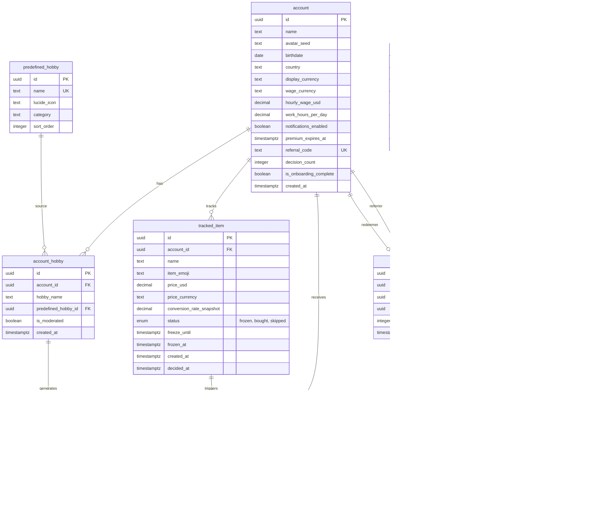

# ADR-004: Database Schema Design

| Field        | Value                                                                                                 |
| ------------ | ----------------------------------------------------------------------------------------------------- |
| **Status**   | Accepted                                                                                              |
| **Author**   | @EmaJasekova                                                                                          |
| **Date**     | 2026-04-19                                                                                            |
| **Decision** | Denormalized per-profile schema with AI suggestion caching, USD as base currency, and daily rate sync |

## 1. Context

BadBuy needs to store user profiles, hobbies, and AI-generated purchase suggestions based on those hobbies, country, and currency. The schema must support caching AI suggestions to avoid redundant API calls, accurate work-hour calculations across currencies, and a stable historical record of savings that does not fluctuate with exchange rates. Users unlock "Premium" features (custom freeze duration, AI suggestion refresh, custom hobbies) by referring others or using a launch promo code. The solution must be simple enough for a 3-person team to ship in one month.

## 2. Considered Options

### 2.1 Normalized shared suggestion cache

A canonical `hobby_key` table normalizes free-form hobby input so suggestions are shared across accounts with the same hobby, country, and currency combination.

**Pros:** Minimizes AI API calls at scale.

**Cons:** Requires a normalization pipeline (freeform text → canonical key), adds complexity, and user overlap on identical hobby+country+currency is unlikely to be significant at our scale.

**Verdict:** Premature optimization. Rejected.

### 2.2 Live currency conversion on every request

Call a conversion API at the moment the user enters a foreign-currency amount, with no local storage of rates.

**Pros:** Always accurate rates, no sync job needed.

**Cons:** Adds a blocking network call to every amount entry, introduces a hard dependency on an external API being available, and is wasteful since rates do not change meaningfully within a day.

**Verdict:** Fragile and wasteful. Rejected.

### 2.3 Store amounts in the user's home currency

Store all amounts in whatever currency the user has set on their profile.

**Pros:** Amounts are immediately human-readable without conversion.

**Cons:** If the user changes their currency in settings, every historical financial row would need to be converted using the rate from when each decision was made. This would require historical rate storage and a migration on every currency change. Fragile and complex.

**Verdict:** Breaks on currency change. Rejected.

### 2.4 Denormalized per-account suggestions, USD as base, daily rate sync

Suggestions are stored per `account_hobby`. All financial amounts are stored in USD as the base currency. Currency rates are fetched once daily via a cron job from a currency exchange API and stored in a `currency_rate` lookup table. A `conversion_rate_snapshot` is frozen on each `tracked_item` at decision time.

**Pros:** Simple queries, no normalization pipeline, conversion is a fast local lookup, historical savings figures never drift with market fluctuations, and user currency changes require no data migration.

**Cons:** Rates can be up to 24 hours stale. Acceptable for purchase decisions.

**Verdict:** Right complexity for the project scope. Selected.

## 3. Decision

We use a denormalized per-account schema. USD is the internal base currency. The choice of a single base currency, rather than storing amounts in the account's currency, ensures that changing the display currency in settings never requires a data migration. USD is chosen because most currency exchange APIs return rates relative to USD natively, eliminating any extra conversion step when syncing rates.

**`account`** stores profile fields including `display_currency`, `wage_currency`, and `country`. Premium status is derived from `premium_expires_at` (NULL = free). All monetary amounts in the database are stored in USD. `display_currency` is the currency used to present prices and savings to the account, with conversion happening at the application layer using `currency_rate`. `wage_currency` records the currency in which the wage was originally entered; `hourly_wage_usd` is the converted USD value used for work-hour calculations. `decision_count` caches the skip + buy count and can be kept in sync via a DB trigger on `tracked_item`. `is_onboarding_complete` gates routing; fields are nullable until the final onboarding step sets it to `true`. `referral_code` is generated by a DB trigger on INSERT with collision retry.

**`predefined_hobby`** is the master list of selectable hobbies shown in the picker. Free accounts pick from this list only; premium accounts may also add free-text hobbies. Retiring a hobby means deleting its row; the FK on `account_hobby.predefined_hobby_id` uses `ON DELETE SET NULL` so existing picks retain their `hobby_name` text and become custom hobbies.

**`account_hobby`** stores each hobby linked to the account. `predefined_hobby_id IS NULL` means the row is custom. A UNIQUE constraint on `(account_id, hobby_name)` prevents duplicates. `is_moderated` is `true` for predefined-origin hobbies; custom hobbies are moderated asynchronously before suggestions are generated for them.

**`account_suggestion`** stores AI-generated suggestions per hobby. `price_usd` stores the suggested price in USD. `country` is denormalized onto the row to serve as part of the cache key. If the account's country changes, existing suggestions are invalidated and regenerated on the next load. Deleting an `account_hobby` row cascades to its suggestions (`ON DELETE CASCADE`).

**`tracked_item`** stores items the account is tracking. `price_usd` is the item price in USD at the time of the decision. `conversion_rate_snapshot` freezes the USD↔display currency rate at that same moment, so the displayed amount (`price_usd × conversion_rate_snapshot`) never changes as market rates fluctuate. Status is an enum: `frozen`, `bought`, `skipped`. `total_saved` is computed dynamically via `SUM(price_usd) WHERE status = 'skipped'`.

**`promo_code`** stores team-issued seed codes (e.g. `LAUNCH2026`). Each code has optional `max_uses` and `expires_at` limits. Account referral codes live on `account.referral_code`, not here.

**`referral_redemption`** is an audit log of every code redemption. Each account may redeem exactly one code ever (UNIQUE on `redeemer_account_id`). Exactly one of `referrer_account_id` or `promo_code_id` must be set per row. A CHECK constraint prevents self-referral.

**`notification`** records in-app notification feed entries. Both `account_id` and `tracked_item_id` FKs use `ON DELETE CASCADE`.

**`currency_rate`** is a standalone lookup table storing exchange rates from USD to each target currency, synced daily via a cron job using a currency exchange API.

## 4. Risks and Mitigation

### R1: Cron job failure leaves rates stale beyond 24 hours

|                |                                                                      |
| -------------- | -------------------------------------------------------------------- |
| **Risk**       | The daily sync job fails silently, leaving rates increasingly stale. |
| **Likelihood** | Low                                                                  |
| **Impact**     | Medium: live conversions become inaccurate over multiple days        |
| **Mitigation** | Accepted for a project of this scope.                                |

### R2: Rounding errors from decimal storage

|                |                                                                                                                                 |
| -------------- | ------------------------------------------------------------------------------------------------------------------------------- |
| **Risk**       | `decimal` can introduce floating point rounding errors in complex aggregations.                                                 |
| **Likelihood** | Low                                                                                                                             |
| **Impact**     | Low: BadBuy is not a banking application. Cent-level inaccuracies in purchase suggestions and savings totals are insignificant. |
| **Mitigation** | Accepted. Integer cent storage is the production-grade alternative, but is out of scope for this project.                       |

### R3: Stale suggestions after account changes country or currency

|                |                                                                                                                      |
| -------------- | -------------------------------------------------------------------------------------------------------------------- |
| **Risk**       | Account changes `country` or `display_currency`, but existing `account_suggestion` rows reflect the previous values. |
| **Likelihood** | Medium                                                                                                               |
| **Impact**     | Low: suggestions shown in the wrong currency or country context. Tracked items themselves are unaffected.            |
| **Mitigation** | On profile update, delete existing `account_suggestion` rows. Suggestions regenerate on next load.                   |

### R4: AI suggestion quality varies by hobby specificity

|                |                                                                                                                          |
| -------------- | ------------------------------------------------------------------------------------------------------------------------ |
| **Risk**       | Vague hobby inputs produce poor or irrelevant suggestions. Since suggestions are cached, bad results persist.            |
| **Likelihood** | Medium                                                                                                                   |
| **Impact**     | Medium: poor suggestions degrade the core account experience                                                             |
| **Mitigation** | Add a manual refresh option on the suggestion screen so the (premium) account can invalidate and regenerate suggestions. |

## 5. Consequences

**Positive:**

- Changing display currency requires no data migration, only the display layer changes.
- Currency conversion is a fast local lookup with no blocking network calls during account interactions.
- `total_saved` is always consistent with reality, computed dynamically from skipped items.
- Schema is straightforward with no normalization pipeline.

**Negative:**

- Requires a daily cron job. Minor operational overhead, fully managed within Supabase.
- Suggestion rows are duplicated across accounts with identical inputs. Acceptable at this scale.
- `decimal` instead of integer cents is a known simplification. Acceptable for an app of this nature.
